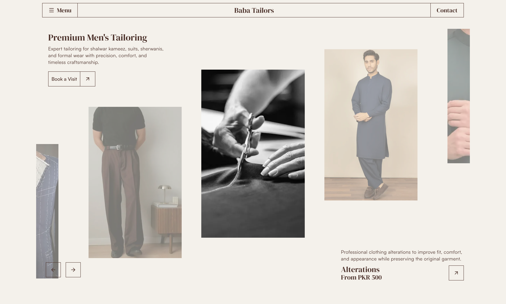

# Moss & Stones



A modern, high-performance website for **Moss & Stones** - a premium men's tailoring business in Gujranwala, Pakistan. Built with Next.js 16, React 19, and Tailwind CSS for exceptional user experience and SEO.

## About Moss & Stones

Moss & Stones combines traditional craftsmanship with modern tailoring techniques to deliver garments with perfect fit, fine craftsmanship, and premium finishing. Services include:

- **Shalwar Kameez** - Traditional stitching with modern fitting
- **Suit Tailoring** - Custom business and formal wear
- **Sherwani Tailoring** - Elegant wedding wear
- **Waistcoat Tailoring** - Classic styles with precision finishing
- **Kurta Pajama** - Comfortable everyday and festive wear
- **Pant Tailoring** - Perfectly fitted trousers
- **Alterations** - Professional clothing alterations

## Tech Stack

- **Framework**: [Next.js](https://nextjs.org) 16 (latest)
- **UI Framework**: React 19
- **Styling**: Tailwind CSS 4 with SCSS
- **Component Libraries**: Shadcn, Base UI, Radix UI
- **Animations**: Motion (Framer Motion alternative)
- **Icons**: Lucide React
- **Code Quality**: Biome (linting & formatting)
- **Package Manager**: Bun

## Getting Started

### Prerequisites

- Node.js 18+ or Bun
- npm/yarn/pnpm or bun

### Installation

```bash
# Install dependencies
npm install
# or
bun install
```

### Development

```bash
npm run dev
# or
bun dev
```

Open [http://localhost:3000](http://localhost:3000) to see the site in development mode. Changes to files will hot-reload automatically.

### Building for Production

```bash
npm run build
npm start
```

## Available Scripts

- `npm run dev` - Start development server with webpack
- `npm run build` - Build for production
- `npm start` - Start production server
- `npm run lint` - Run Biome linting checks
- `npm run format` - Format code with Biome

## Project Structure

```
.
├── app/                  # Next.js App Router pages
│   ├── page.tsx         # Homepage
│   ├── about/           # About page
│   ├── contact/         # Contact page
│   ├── layout.tsx       # Root layout
│   └── ...
├── components/
│   ├── blocks/          # Page sections (hero, grid, sliders)
│   ├── cards/           # Reusable card components
│   ├── heros/           # Hero section components
│   └── ui/              # Base UI components
├── styles/              # Global SCSS styles
├── types/               # TypeScript type definitions
├── constants/           # App constants and data
├── lib/                 # Utility functions
├── fonts/               # Local font files (Satoshi)
└── public/              # Static assets
```

## Key Features

- **Responsive Design** - Mobile-first approach with Tailwind CSS
- **SEO Optimized** - Metadata, Open Graph, Twitter Cards configured
- **Performance** - Image optimization, font optimization
- **Modern Components** - Slider testimonials, category grids, feature cards
- **TypeScript** - Full type safety throughout the project
- **Tailored Messaging** - Custom content showcasing Moss & Stones' expertise

## Environment Variables

Create a `.env.local` file (or copy from `.example.env`):

```env
NEXT_PUBLIC_SERVER_URL=http://localhost:3000
```

## Deployment

The application is ready for deployment on [Vercel](https://vercel.com), the creators of Next.js.

### Deploy with Vercel

```bash
vercel deploy
```

Or connect your Git repository to Vercel for automatic deployments.

## Code Quality

This project uses **Biome** for code quality management:

```bash
# Check for issues
npm run lint

# Format code
npm run format
```

## Credits

This project is a complete rebuild of a Framer template, hand-crafted with Next.js and modern web technologies to create a fully functional production-ready website.
